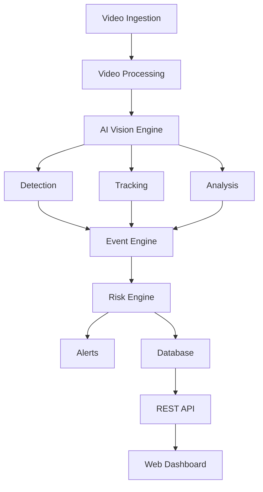

# AVIP — AI Vision Intelligence Platform

AVIP is an open-source video intelligence platform designed for real-time computer vision analysis, multi-camera supervision, event detection, and risk assessment.

## Description

The project aims to provide a modular foundation for AI-driven video analytics. It is designed to evolve from a clean, extensible architecture into a production-ready platform for security, operations, and situational awareness workflows.

## Features

| Capability | Status |
| --- | --- |
| Person Detection | Planned |
| Face Detection | Planned |
| Object Detection | Planned |
| Vehicle Detection | Planned |
| Dangerous Object Detection | Planned |
| Multi-Object Tracking | Planned |
| Movement Analysis | Planned |
| Behavior Analysis | Planned |
| Zone Management | Planned |
| Event Engine | Planned |
| Risk Scoring | Planned |
| Alert System | Planned |
| Multi-Camera Management | Planned |
| Web Dashboard | Planned |

## Architecture



## Technology Stack

- Backend: Python 3.12, FastAPI, Pydantic, SQLAlchemy, Alembic
- AI/vision: PyTorch, OpenCV, Ultralytics YOLO, ONNX Runtime
- Data: PostgreSQL, Redis
- Frontend: Next.js, React, TypeScript, Tailwind CSS
- Infrastructure: Docker, Docker Compose, GitHub Actions
- Monitoring (future): Prometheus, Grafana, Sentry

## Repository Structure

```text
avip/
├── backend/
│   ├── app/
│   │   ├── api/
│   │   ├── core/
│   │   ├── models/
│   │   ├── schemas/
│   │   ├── services/
│   │   ├── repositories/
│   │   └── main.py
│   └── tests/
├── ai/
│   ├── detection/
│   ├── tracking/
│   ├── face/
│   ├── vehicles/
│   ├── weapons/
│   ├── behavior/
│   └── inference/
├── video/
│   ├── ingestion/
│   ├── processing/
│   └── streaming/
├── event_engine/
│   ├── rules/
│   ├── scoring/
│   └── alerts/
├── database/
│   ├── migrations/
│   └── seeds/
├── frontend/
├── infrastructure/
│   ├── docker/
│   ├── monitoring/
│   └── nginx/
├── configs/
├── scripts/
├── docs/
│   ├── architecture/
│   ├── ai/
│   ├── deployment/
│   └── security/
├── .github/
│   ├── workflows/
│   └── ISSUE_TEMPLATE/
├── .gitignore
├── .dockerignore
├── .env.example
├── docker-compose.yml
├── Dockerfile
├── CONTRIBUTING.md
├── SECURITY.md
├── LICENSE
├── pyproject.toml
└── README.md
```

## Development

### Prerequisites

- Python 3.12+
- Docker and Docker Compose
- Node.js 20+ (for frontend work)

### Local installation

```bash
python -m venv .venv
source .venv/bin/activate  # Windows: .venv\Scripts\activate
pip install -e .
pytest
```

### Run API locally

```bash
uvicorn backend.app.main:app --reload --host 0.0.0.0 --port 8000
```

## Docker

```bash
cp .env.example .env
docker compose up --build
```

This starts the backend, frontend, PostgreSQL and Redis services.

## Testing

```bash
pytest backend/tests
```

## Code Quality

The project enforces the following conventions:

- PEP 8 compliance and clear type hints
- Module boundaries and explicit interfaces
- Short functions and explicit service responsibilities
- Ruff for linting and formatting checks
- MyPy for static validation where useful

## Roadmap

### Phase 0

- repository initialization
- environment and CI bootstrap
- baseline architecture and documentation

### Phase 1

- video ingestion and frame processing
- object detection abstractions
- person and vehicle detection
- tracking engine

### Phase 2

- zone management
- event and risk engine
- alerting

### Phase 3

- dangerous object detection
- behavior analysis
- multi-camera support

### Phase 4

- FastAPI API and PostgreSQL integration
- WebSocket event feeds
- web dashboard

### Phase 5

- GPU optimization and ONNX/TensorRT adoption
- production deployment

## Security & Privacy

AVIP will follow privacy-by-design principles. The project must avoid collecting unnecessary biometric identifiers, must separate access control from detection logic, and must implement retention and audit controls before any production deployment.

## License

This project is licensed under the MIT License.
