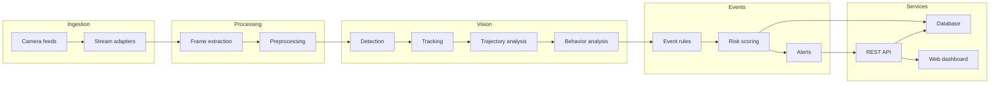

# AVIP System Architecture

## Overview

AVIP is structured as a modular vision intelligence platform. The design separates ingest, processing, analytics and business workflows so that each subsystem can evolve independently.

## Layered architecture

## Responsibilities

### Video ingestion

This layer accepts input from RTSP, file-based sources or future cloud pipelines. It focuses on frame extraction and stream health monitoring rather than model inference.

### Video processing

Processing ensures that frames are normalized, decoded and prepared for downstream vision models. Quality checks and metadata tagging happen here.

### AI vision engine

Detection, tracking and behavior analysis are grouped into a dedicated AI layer. This keeps the platform extensible and avoids coupling model logic with endpoint logic.

### Event engine

The event engine combines signal data (detections, zones, movement, tracking) into user-facing events such as zone_entry, line_crossing or abandoned_object.

### Risk engine

The risk engine uses rules, context and confidence values to assign a risk level. It should produce outputs that can be reviewed by operators but not treated as absolute truth.

### API and dashboard

The REST API serves health, camera state, events and alerts to the frontend. The dashboard remains observability-oriented and reads from the same event stream abstraction used by backend services.

## Communication patterns

- stream adapters push frame metadata into the processing pipeline
- detectors emit structured detection data
- tracking services enrich detections with track identity
- event rules generate domain events
- risk rules update alert state and severity, while the API exposes read models

## Data flow

1. camera stream enters the platform
2. frame extraction produces normalized frames
3. detection and tracking create object-level observations
4. event rules detect anomalies or state transitions
5. risk scoring attaches severity to the event
6. alerts and dashboards consume the resulting state

## Key design principles

- explicit boundaries between model logic and API logic
- serializable event contracts rather than raw frame coupling
- pluggable inference backends
- privacy-aware architecture, especially for face handling
- modular service boundaries to support future scale
